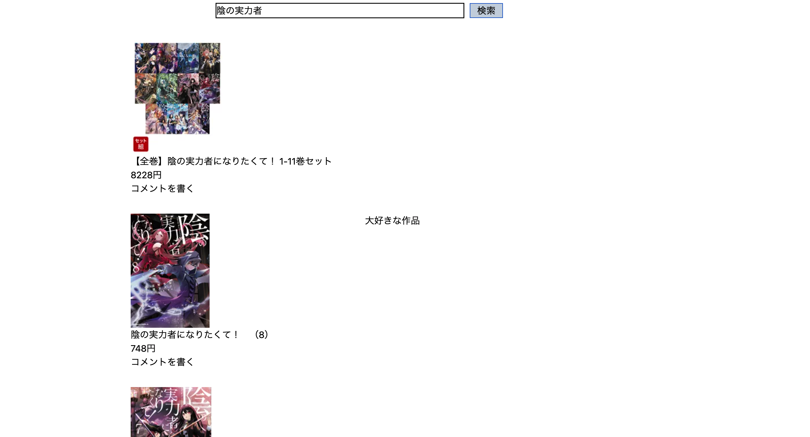

# BookReview(鋭意製作中)



## 環境
React 18.2.0  
TypeScript 5.0.2  
Vite 4.4.5  
React Router 6.17.0  
Tailwindcss 3.3.3


# 動作確認
※ 本サービスは楽天の書籍検索APIを使用しているため、事前にアプリケーションIDを取得して下さい。(詳しくは[楽天APIの利用方法](https://qiita.com/fmyuk/items/2067bad47904fcfeeb60)をお読み下さい。)
また、BookReview_JS_serverと合わせて使用して下さい

1. Githubから本リポジトリをクローンします。

2. クローンしたリポジトリに移動し、以下のコマンドを入力
```
npm install
```

3. コマンドの実行完了後、App.jsxのhandleSearch関数内にある${APP_ID}を取得したアプリケーションIDに書き換えて以下のコマンドを入力し、アプリを起動
```
npm run dev
```

4. アプリ起動後、検索欄に書籍名を入力し検索ボタンを押下すると、該当書籍が表示されます
